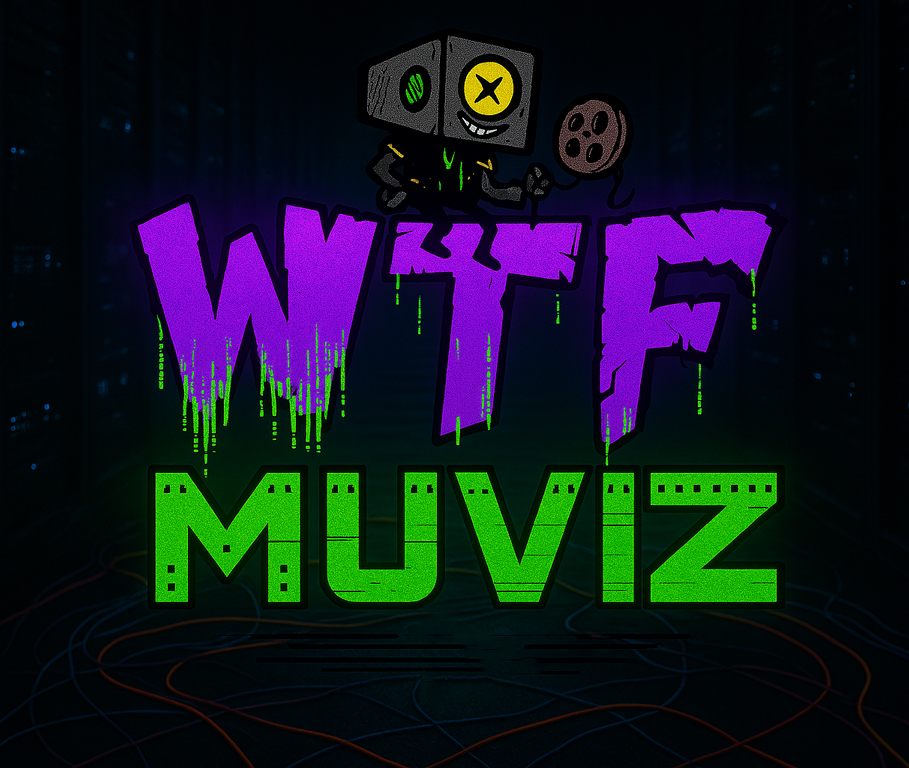

<div dir="rtl" style="direction: rtl; text-align: right;">

## اصلا WTF Muviz چیه؟ 🤔

<p dir="rtl">**WTF Muviz** یه کتابخونه دیجیتال جادوییه که انگار یه دستیار شخصی برای مدیریت آرشیو فیلم و سریال‌هاته! 📚 تصور کن یه قفسه پر از فیلم داری که نه‌تنها همه‌چیز رو مرتب نگه می‌داره، بلکه خودش می‌فهمه تو چی دوست داری، چی دیدی و امشب باید چی ببینی! 🧠 از پخش فایل‌های روی هاردت گرفته تا استریم انلاین با کیفیت خفن یا پیدا کردن زیرنویس، پیشنهاد فیلم‌های باحال و حتی ذخیره پوسترهای خوشگل—همه‌چیز اینجاست! 🖼️ تازه، یه سری فیچر بامزه هم داره، مثل ویجت قیمت دلار (چون تو ایران این همیشه لازمه!) و رادیو آنلاین برای وقتی که دلت یه موزیک یا اخبار می‌خواد! 🎧</p>

## داستان پروژه: از یه ایده ساده تا یه پلتفرم خفن 🎬

<p dir="rtl">همه‌چیز از یه پلیر ساده برای پخش فایل‌های هارد قدیمیم شروع شد. دلم می‌خواست کیفیتشون رو با **VSR** انویدیا زنده کنم و یه تجربه نوستالژیک باحال داشته باشم. یه روز برای حال دادن به رفیقم که مانیتورش سوخته بود، پلیر رو خفن‌تر کردم و کلی فیچر بامزه بهش اضافه کردم. همونجا بود که گفتم: چرا اینو به یه چیز بزرگ‌تر تبدیل نکنم؟ 💡 تصمیم گرفتم خودمو بندازم تو یه چالش حسابی: یه پلتفرم درست‌حسابی فقط با **HTML** و **JavaScript** خالص—بدون فریم‌ورک‌های پیچیده! 😅 درست همون موقع **Grok 3** معرفی شده بود و شد رفیق شفیقم تو این مسیر. روزی ۵-۶ ساعت کد زدم، با منطق‌های پیچیده سرو کله زدم و از غرق شدن تو دنیای برنامه‌نویسی لذت بردم. حالا **WTF Muviz** چیزیه که هر فیلم‌بازی آرزوشو داره: یه فضای شیک، مرتب و پر از امکانات برای مدیریت دنیای فیلم و سریال‌هاش! 🥰</p>

---

## ویژگی‌های خفن WTF Muviz 🚀

<p dir="rtl">بیاید یه تور توی این دنیای دیجیتال بزنیم و ببینیم **WTF Muviz** چه گنجایی برامون داره! 🎟️</p>

### ۱. کتابخونه دیجیتال: گنجینه شخصی فیلم و سریال 📖✨

<p dir="rtl">قلب تپنده پروژه اینجاست! یه فضای هوشمند که انگار یه کتابدار باحال داری که تو یه چشم به هم زدن آرشیوت رو مرتب می‌کنه. 😎</p>

- **تشخیص هوشمند فایل‌ها** 🕵️‍♂️
  <p dir="rtl">فقط کافیه یه فایل ویدیویی رو درگ‌اند‌دروپ کنی یا آپلود کنی. سیستم خودش می‌ره توی اینترنت (مثل APIهای TMDB) و همه‌چیز رو پیدا می‌کنه: اسم کامل فیلم، سال ساخت، ژانر، کارگردان، بازیگرها، خلاصه داستان و حتی یه پوستر باکیفیت! 🖼️ فرقی نمی‌کنه اسم فایلت چی باشه—حتی اگه یه چیزی مثل `movie_2023x256[10bit].mp4` باشه، پروژه خودش می‌فهمه داستان چیه! 😜</p>

- **مدیریت آرشیو مثل یه رئیس** 💼
  <p dir="rtl">اینجا می‌تونی کل آرشیوت رو مثل یه حرفه‌ای مدیریت کنی:</p>  
  - **لیست "بعداً ببین" (Watch Later)**: یه فیلم خفن پیدا کردی ولی الان وقتش نیست؟ بندازش تو این لیست! می‌تونی بهش اولویت بدی (مثلاً "اینو حتماً جمعه شب ببین") یا یادداشت بذاری که چرا انتخابش کردی—مثلاً "دوستم گفت آخرش غافلگیر می‌شم!" 😏  
  - **لیست "تماشا شده‌ها" (Watched)**: هر فیلمی که می‌بینی، خودکار می‌ره تو این بخش. می‌تونی براش امتیاز بدی (مثلاً ۳ از ۵) و حس و حالت رو بنویسی. من که همیشه یادم می‌ره داستان فیلم چی بود، یه یادداشت می‌ذارم مثل "اینو با پاپ‌کورن دیدم، آخرش اشکم دراومد!" 😢🍿  
  - **لیست "مورد علاقه‌ها" (Favorites)**: فیلم‌ها و سریال‌هایی که قلب تو رو بردن اینجا جمع می‌شن. می‌تونی مرتبشون کنی، فیلتر بذاری یا یه گالری از پوسترهای خوشگلشون درست کنی! 💖  
  - **تاریخچه (History)**: یه تایم‌لاین کامل از همه‌چیزایی که دیدی، با جزئیاتی مثل تاریخ تماشا، مدت زمان و حتی حال و هوات موقع دیدن! 📅

- **یادداشت و نقد شخصی** ✍️
  <p dir="rtl">باحال‌ترین بخش اینه که می‌تونی برای هر فیلم یا سریال یادداشت بنویسی! نقد خودتو بنویس، حس و حالت رو ثبت کن یا یه دیالوگ باحال از فیلم رو نگه دار. این یادداشت‌ها مثل یه دفترچه خاطرات دیجیتالن که همیشه همراهتن. اگه مثل من گاهی یادت می‌ره کدوم فیلم رو کی دیدی یا چرا خوشت اومده، این قابلیت حسابی به کارت میاد! 📓</p>

- **زیرنویس هوشمند** 📜
  <p dir="rtl">وقتی یه فایل رو آپلود می‌کنی، سیستم می‌تونه زیرنویس مناسب فارسی رو براش پیدا کنه و بهت امکان دانلود یا پخش مستقیم بده. دیگه لازم نیست خودت ساعت‌ها دنبال زیرنویس درست بگردی! 😌</p>

- **گالری پوسترهای باکیفیت** 🖼️
  <p dir="rtl">اگه مثل من عاشق پوسترهای فیلم هستی، اینجا برات یه بهشته! می‌تونی پوسترهای باکیفیت (حتی نسخه‌های فارسی) رو ذخیره کنی و یه گالری بصری از آرشیوت داشته باشی. هر وقت نگاشون می‌کنی، انگار داری توی یه گالری هنری فیلم قدم می‌زنی! 🎨</p>

- **بکاپ و جابه‌جایی آسون** 💾
  <p dir="rtl">نگران پاک شدن آرشیوت نباش! می‌تونی کل داده‌هات—از لیست‌ها و یادداشت‌ها تا امتیازها—رو توی یه فایل JSON ذخیره کنی و روی یه دستگاه دیگه آپلود کنی. اینجوری اگه لپ‌تاپت عوض شد یا خواستی آرشیوتو با دوستت به اشتراک بذاری، همه‌چیز سر جاشه! 📦</p>

- **ذخیره‌سازی سبک و امن** 🔒
  <p dir="rtl">همه داده‌ها توی `localStorage` مرورگر ذخیره می‌شن. یعنی نیازی به سرور یا دیتابیس خارجی نداری و پروژه حسابی سبک می‌مونه. هیچ اطلاعاتی جایی آپلود نمی‌شه و خیالت از بابت امنیت راحته! 🛡️ حتی اگه بخوای حافظه مرورگرت رو خالی کنی، با یه بکاپ ساده همه‌چیز برمی‌گرده.</p>

### ۲. پلیر حرفه‌ای: پخش با کیفیت خفن! 🎞️

<p dir="rtl">پلیر **WTF Muviz** فقط برای پخش نیست—یه تجربه کامل از فیلم دیدنه! 😍</p>

- فایل‌های لوکال و استریم رو با کنترل‌های کامل (پخش، توقف، ولوم، زیرنویس، فول‌اسکرین) پخش می‌کنه. 🖱️
- از **VSR** انویدیا پشتیبانی می‌کنه تا کیفیت فیلم‌های قدیمی رو به 4K برسونه! انگار داری یه فیلم کلاسیک رو تو سینما می‌بینی! 📺
- می‌تونی زیرنویس رو دستی آپلود کنی یا بذاری سیستم خودش پیداش کنه. حتی اگه زیرنویس یه کم ناهماهنگ باشه، می‌تونی با یه تنظیم ساده درستش کنی! ⏱️

### ۳. فیلم‌یاب و سریال‌یاب: گشت‌وگذار توی دنیای سینما 🔎

<p dir="rtl">دنبال یه فیلم یا سریال باحال می‌گردی؟ این بخش برات ساخته شده!</p>

- جستجوی پیشرفته با فیلترهای ژانر، سال، امتیاز IMDb، بازیگر و کارگردان. 🧐
- نتایج توی کارت‌های شیک با پوسترهای باکیفیت و جزئیات کامل نشون داده می‌شن. انگار داری توی یه کاتالوگ دیجیتال ورق می‌زنی! 🃏
- پیشنهادهای هوشمند بر اساس چیزی که دیدی یا تو آرشیوته. مثلاً اگه عاشق یه فیلم علمی-تخیلی شدی، چندتا فیلم مشابه دیگه بهت نشون می‌ده که نه تکرارین، نه از سلیقه‌ات دورن! 🧠

### ۴. رادیو آنلاین: موزیک و اخبار برای حال و هوا 🎧

<p dir="rtl">یه بخش باحال که حس و حال پروژه رو زنده‌تر می‌کنه!</p>

- ایستگاه‌های رادیویی از کل دنیا—از هیپ‌هاپ و پاپ گرفته تا اخبار. 🗣️
- می‌تونی دوتا ایستگاه سفارشی اضافه کنی (مثلاً من یکی رو اخبار گذاشتم، یکی هیپ‌هاپ دهه ۹۰!). 😎
- وقتی داری آرشیوت رو مرتب می‌کنی یا دنبال فیلم می‌گردی، یه موزیک باحال پخش کن که حالشو ببری! 🎶

### ۵. اطلاعات لحظه‌ای: چون تو ایرانیم! 💸🌦️

<p dir="rtl">بعضی چیزا همیشه باید دم دست باشن:</p>

- **قیمت دلار**: چون تو ایران زندگی بدون چک کردن دلار مگه می‌شه؟ 😅
- **آب‌وهوا**: یه ویجت بامزه که بهت می‌گه امروز چتر لازم داری یا نه! ☔

### ۶. حالت بز (Goat Mode): چالش فیلم‌بازای حرفه‌ای 🐐

<p dir="rtl">مخفف "Greatest of All Time"!</p>

- از ۲۵۰ فیلم برتر IMDb بهت پیشنهاد می‌ده، بدون اینکه چیزی که قبلاً دیدی یا تو آرشیوته تکرار بشه. 🎯
- یه شمارنده باحال داره که نشون می‌دهد تا آخر عمر می‌تونی کل لیست رو تموم کنی یا نه—یه چالش خفن برای تنبل‌هایی مثل خودم! 😜

### ۷. تم‌های شیک و شخصی‌سازی 🌈

<p dir="rtl">ظاهر پروژه رو هرجور دوست داری عوض کن!</p>

- کلی تم رنگی باحال برای انتخاب. 🎨
- می‌تونی افکت‌های سنگین رو برای دستگاه‌های ضعیف خاموش کنی تا همه‌چیز روون باشه. ⚙️
- انیمیشن‌های نئونی و افکت‌های بصری که حس و حال پروژه رو چند برابر می‌کنن! ✨

### ۸. چند زبانه: رابط کاربری و نتایج جستجو 🌍

<p dir="rtl">- رابط کاربری پروژه به صورت کامل **دو زبانه (انگلیسی و فارسی)** طراحی شده و بسته به زبان کاربر به صورت پویا تغییر می‌کنه.</p>
<p dir="rtl">- نتایج جستجو و دیتای فیلم‌ها و سریال‌ها (مثل عنوان، خلاصه داستان، ژانر و...) قابلیت ترجمه به زبان‌های مختلف رو دارن. لیست زبان‌هایی که پشتیبانی می‌شن:</p>

- 🇬🇧 English
- 🇮🇷 Persian (فارسی)
- 🇫🇷 French
- 🇪🇸 Spanish
- 🇩🇪 German
- 🇮🇹 Italian
- 🇯🇵 Japanese
- 🇰🇷 Korean

### ۹. مینی‌پنل‌های بامزه: حس خوب تضمینی! 🎉

<p dir="rtl">ویجت‌های رندوم مثل پیشنهادهای لحظه‌ای یا رادیو که حال و هوای پروژه رو زنده‌تر می‌کنن. هر بار که بازش می‌کنی، یه سورپرایز کوچولو منتظرته! 😄</p>

---

## نصب و راه‌اندازی: آماده‌ست؟ بریم! 🚀

### پیش‌نیازها 🛠️

<p dir="rtl">- یه مرورگر مدرن (کروم، فایرفاکس، اج). 🌐</p>
<p dir="rtl">- اگه می‌خوای از **VSR** انویدیا استفاده کنی، کارت گرافیک RTX لازم داری. 💻</p>

### نصب 📥

<p dir="rtl">1. حالا می‌تونی **WTF Muviz** رو از آدرس **Muviz.wtf** چک کنی! اگه دوست داری آفلاین کار کنی، کافیه فایل پروژه رو از همونجا دانلود کنی و با مرورگرت اجرا کنی. به همین راحتی! 📥  
   یا اگه می‌خوای از گیت‌هاب بری، پروژه رو کلون کن:</p>
```bash
git clone https://github.com/mehrun-com/WTF-Muviz.git
cd wtf-muviz
```

<p dir="rtl">2. یه سرور لوکال راه بنداز (مثل Live Server توی VSCode) یا مستقیم فایل `index.html` رو تو مرورگر باز کن. 🖱️</p>

<p dir="rtl">3. حالا فایل‌های ویدیوییت رو بنداز تو پروژه و از کتابخونه دیجیتال لذت ببر! 😎</p>

### یه نکته بامزه 😜

<p dir="rtl">اگه اولین بارت نیست که فیلم آرشیو می‌کنی، یه لیوان قهوه بردار، چون قراره ساعت‌ها غرق این پروژه شی! ☕</p>

---

## تکنولوژی‌های استفاده‌شده: ابزارای جادویی من! 🪄

- **HTML5** و **CSS3**: برای رابط کاربری شیک و انیمیشن‌های نئونی که دلت رو می‌برن! 🎨
- **JavaScript (Vanilla)**: منطق اصلی پروژه—خالص، چالشی و پر از عشق! 💪
- **Grok 3**: دستیار هوش مصنوعی که تو کدنویسی و ایده‌پردازی رفیقم بود. 🤖
- **TMDB API**: برای گرفتن اطلاعات فیلم‌ها، پوسترها و جزئیات باحال. 🎭
- **LocalStorage**: ذخیره‌سازی سبک و امن بدون نیاز به سرور. 💿
- **NVIDIA VSR**: آپ‌اسکیل ویدیوها برای کیفیت خیره‌کننده. 📺
- یه عالمه عشق و قهوه برای زنده نگه داشتن من تو این ۶۰ روز! ☕❤️

---

## برنامه‌های آینده: قراره بترکونیم! 🔥

<p dir="rtl">**WTF Muviz** تازه اول راهشه!:</p>

- **پشتیبانی از دستگاه‌های بیشتر**: بهینه‌سازی برای موبایل و تبلت که هرجا باشی همراهت باشه. 📱

---

## پروژه در چه وضعیه؟ ⚠️

<p dir="rtl">> 🔒 **این پروژه در حال حاضر در حالت بتاست.**</p>

<p dir="rtl">> فعلا کدها به‌صورت **obfuscated (ناخوانا)** نوشته شدن چون فعلا پروژه در مرحله آزمایشیه و تا استیبل شدن پروژه ادامه داره—گرچه پروژه به‌صورت اوپن‌سورسه—این کار برای جلوگیری از سواستفاده‌ی تجاری در مراحل ابتدایی و بهینه نبودن کد انجام شده.</p>

<p dir="rtl">> توسعه‌ی اصلی در یک **ریپازیتوری خصوصی** در حال انجامه. اگر علاقه‌مند به مشارکت در توسعه‌ی پروژه هستی، خوشحال می‌شم ازت دعوت کنم—فقط کافیه در تماس باشی! 😉</p>

<p dir="rtl">اگه تو هم ایده‌ای داری، تو **Issues** بنویس که باهم بترکونیم! 😄</p>

---

<div dir="rtl" style="direction: rtl; text-align: right;">
نکات مهم برای کاربران 📢
طراحی برای کاربران ایرانی و مسائل کپی‌رایت ⚖️ <p dir="rtl">این پروژه مخصوص کاربرای ایرانی طراحی شده که به منابع قانونی استریم دسترسی ندارن. اگه تو ایران هستید، **WTF Muviz** یه راه حل خفن برای مدیریت و تماشای آرشیو فیلم و سریال‌هاتونه! 😎 ولی اگه خارج از ایران هستید، همچنان می‌تونین از کتابخونه دیجیتال و مدیریت آرشیو استفاده کنین. فقط یادتون باشه برای استریم آنلاین، مسئولیت رعایت **قوانین کپی‌رایت** و قوانین کشور خودتون با شماست! 🛡️</p>
فاز آزمایشی و کد معرف 🔐 <p dir="rtl">این پروژه الان تو فاز آزمایشی (بتا) قرار داره و برای رفع باگ‌ها، فقط با **کد معرف** برای یه گروه محدود از کاربرا فعال می‌شه. بعد از رفع مشکلات، همه می‌تونن بدون نیاز به کد ازش استفاده کنن! اگه مشتاق دریافت کد هستید، **WTF Muviz** رو با بقیه به اشتراک بذارید تا زودتر به دستتون برسه! 🚀</p>
تبلیغات و uBlock Origin 🛑 <p dir="rtl">پروژه از منابع اینترنتی عمومی و رایگان استفاده می‌کنه و ما هیچ کنترلی روی تبلیغات نشون‌داده‌شده نداریم و ازشون سودی نمی‌بریم. برای یه تجربه تمیز و بدون دردسر، حتماً افزونه **uBlock Origin** رو روی مرورگرتون نصب کنین! 😎</p>
استفاده از VPN 🌐 <p dir="rtl">اگه خارج از ایران هستید، حواستون باشه که تو بعضی کشورها منابع استریم ممکنه قانونی نباشن. برای دسترسی بهتر و امن‌تر، از **VPN** استفاده کنین! 🔒</p>
نسخه دسکتاپ برای بهترین تجربه 💻 <p dir="rtl">برای اینکه از تبلیغات خلاص بشین و بهترین عملکرد رو داشته باشین، پیشنهاد می‌کنیم نسخه **دسکتاپ** این اپلیکیشن رو امتحان کنین. تجربه‌ای روون و خفن منتظر شماست! 😍</p>

## لایسنس: 🔐

جزئیات لایسنس پروژه را در [LICENSE.md](LICENSE.md) ببینید.

---

## تماس با من: بیا گپ بزنیم! 📩

- **ایمیل**: 98newfolder@gmail.com
- **توییتر/X**: [@mehrun_com](https://x.com/mehrun_com)
- **توییتر/X**: [@WTFmuviz](https://x.com/WTFmuviz)

<p dir="rtl">دوست داری یه ایده جدید برای پروژه بندازیم وسط؟ من همیشه آماده‌م! 🎬💬</p>

---

## یه حرف آخر از ته قلب ❤️

<p dir="rtl">**WTF Muviz** برای من فقط یه پروژه نیست—یه سفر پر از عشق به فیلم، کد و خلاقیته! 🥰 امیدوارم وقتی باهاش کار می‌کنی، همون حس خوب و حال خفنی که من موقع ساختنش داشتم بهت منتقل بشه. برو آرشیوتو بنداز تو پروژه، یه فیلم باحال انتخاب کن، پاپ‌کورنتو آماده کن و غرق لذت شو! 🍿✨</p>

</div>
